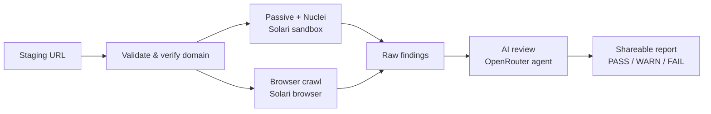

# SiteScan

Pre-production security scanner for staging URLs. Paste a URL, get a shareable report with a **PASS / WARN / FAIL** verdict before you ship.

Built with Next.js, [Solari](https://docs.getsolari.com/) cloud sandboxes & browsers, and an OpenRouter AI agent for final review.

## What it does

SiteScan checks a site you own for common security issues — TLS, headers, exposed secrets, cookie flags, mixed content, and known vulnerabilities — then an AI agent triages the findings so you know what actually matters.

## How it works



1. **Passive + Nuclei** — TLS, security headers, and vulnerability templates run in a Solari sandbox.
2. **Crawl** — A cloud browser walks your site for cookies, secrets, forms, and mixed content.
3. **AI review** — An agent investigates findings and issues a final verdict.
4. **Report** — Results stream live and persist at `/s/{scan-id}`.

## Quick start

```sh
cd project_scan
cp .env.example .env   # add SOLARI_API_KEY (required)
docker compose up --build
```

Open [http://localhost:3000](http://localhost:3000) and scan.

See [`project_scan/README.md`](project_scan/README.md) for full setup, env vars, and self-hosting.
