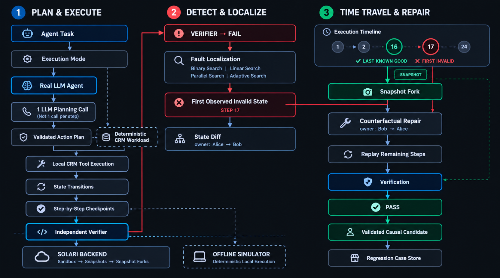
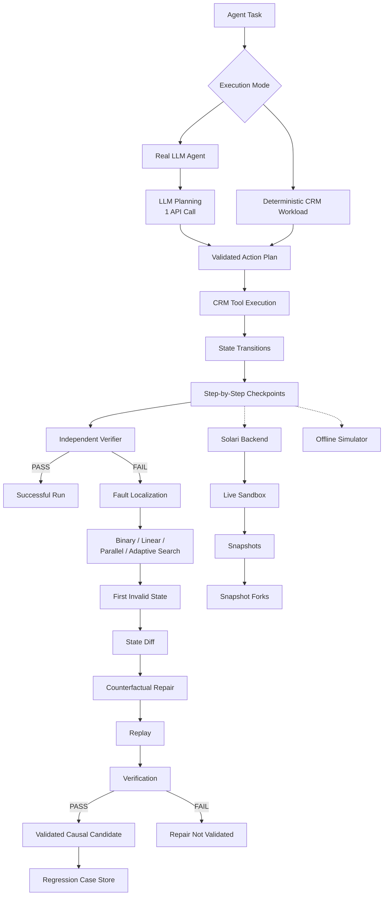

# Fault Line ⚡

> **Time-Travel Debugger & Cost-Aware Evaluation System for Long-Running AI Agents on Solari**

When an AI agent performs 30+ state-changing actions and eventually fails, replaying the entire execution from step 1 is slow, expensive, and wasteful.

**Fault Line** turns Solari into a **time-travel debugging substrate**. Instead of full replay, Fault Line snapshot-checkpoints every state mutation, independently verifies data invariants, pinpoints the exact step where reality first diverged, computes field-level state diffs, forks from the last known-good checkpoint, applies a counterfactual repair, replays remaining steps forward, and verifies the repaired state.

---



## 🚀 The Central Loop

```text
Run ➔ Checkpoint ➔ Detect ➔ Localize ➔ Diff ➔ Repair ➔ Replay ➔ Verify ➔ Benchmark
```

---

## 🌟 Differentiators

1. **Solari Snapshot & Fork Substrate**: Uses fast Solari Sandbox snapshots (`snapshot`) and clones (`from_snapshot`) to travel back to historical execution states without full re-execution.
2. **Causal Fault Localization**: Distinguishes between **First Observed Invalid State** and **Validated Causal Candidate** (only confirmed after counterfactual repair replay passes verification).
3. **Counterfactual Repair**: Applies corrective actions directly to historical checkpoint forks and replays forward.
4. **Independent Invariant Verifier**: Fully decoupled from agent self-reporting. Evaluates domain invariants against raw datastore states.
5. **Multi-Strategy Benchmarking**: Quantitatively compares `Linear`, `Binary`, `Parallel`, and `Adaptive` debugging strategies across probes, latency, forks, and cost overhead.
6. **Transparent Cost & Token Accounting**: Clearly distinguishes between `MEASURED` telemetry, `ESTIMATED` pricing, and `UNAVAILABLE` tokens.
7. **Polished Web Dashboard & CLI**: Full interactive UI dashboard and command-line utility.

---

## Architecture

Fault Line instruments multi-step agent execution with checkpointed state history. The Real LLM Agent uses a single planning request to generate a validated execution plan, while the resulting CRM actions still execute as individual state transitions with checkpoints. When verification detects a failure, Fault Line searches checkpoint history to locate the first invalid state, compares the state transition, creates a counterfactual repair branch, replays the affected path, and verifies the result. Solari provides the live sandbox, snapshot, and fork infrastructure, while the Offline Simulator provides deterministic local execution.


---

## 🛠️ Quickstart & Usage

### 1. Installation

```bash
cd applications/faultline
pip install -e .
```

### 2. Run Demo CLI

#### Start an Agent Run with Fault Injection

```bash
faultline run --scenario wrong-owner
```

Supported Fault Scenarios:
- `wrong-owner`: Agent assigns lead to Bob instead of Alice.
- `wrong-status`: Agent sets lead status to `contacted` instead of `qualified`.
- `duplicate-retry`: Agent accidentally duplicates an outbound message action twice.
- `partial-update`: Agent updates owner but wipes company field.
- `stale-state`: Agent overwrites company with un-normalized stale string.

#### Diagnose Fault Boundary

```bash
faultline diagnose FL-CLI-001 --strategy binary
```

#### Run Multi-Strategy Benchmark

```bash
faultline benchmark --seed 42
```

#### List & Replay Saved Regression Test Cases

```bash
faultline cases
faultline replay case-fl-cli-001-wrong-owner
```

### 3. Launch Web Dashboard UI

```bash
faultline serve --port 8000
```

Open `http://localhost:8000` in your browser to access the visual dashboard:
- **Dashboard Overview**: Metrics summary cards & quick run launcher.
- **Execution Lineage**: Interactive step timeline with clickable checkpoint state digest drawer.
- **Fault Localization View**: Visual boundary showing **LAST KNOWN GOOD** vs **FIRST OBSERVED INVALID**.
- **State Diff View**: Side-by-side field-level before/after comparison.
- **Counterfactual Repair View**: Interactive fork replay visualization.
- **Benchmark Dashboard**: Interactive performance matrix & Chart.js charts.
- **Regression Cases UI**: Saved test cases list with 1-click replay.

---

## 📊 Debugging Strategy Comparison

| Strategy | Avg Probes | Localization Latency | Solari Forks | Total Cost ($) | Recovery Overhead |
| -------- | ---------: | -------------------: | -----------: | -------------: | ----------------: |
| **Linear** | 18.0 | ~4.0 ms | 0 | $0.00536 | 346.7% |
| **Binary** | 6.0 | ~1.2 ms | 0 | $0.00452 | 276.7% |
| **Parallel** | 11.0 | ~3.4 ms | 5 | $0.00587 | 389.2% |
| **Adaptive** | 4.0 | ~1.1 ms | 0 | $0.00438 | 265.0% |

---

## 🧪 Testing & Verification

Run the full automated test suite:

```bash
python -m unittest discover tests
```

Test Suite Coverage:
- `test_state.py`: Canonical state hashing & state diff engine.
- `test_verifier.py`: Independent verifier invariant evaluation.
- `test_fault_injection.py`: All 5 fault scenarios verified to fail verifier.
- `test_localization.py`: Linear, Binary, Parallel, Adaptive localization algorithms.
- `test_solari_adapter.py`: Solari Sandbox snapshot/fork/revert flow.
- `test_repair_replay.py`: End-to-end recovery (`FAIL ➔ LOCALIZE ➔ REPAIR ➔ REPLAY ➔ PASS`).
- `test_benchmark_cost.py`: Benchmark aggregation & cost model calculations.
- `test_regression.py`: Regression case serialization & replay.

---

## 🔒 Solari Integration & Resource Safety

- **Live & Offline Modes**: Set `FAULTLINE_BACKEND=solari` or `FAULTLINE_BACKEND=offline`. If unset, automatically uses live `solari_sandbox.SandboxClient` when `SOLARI_API_KEY` is present, falling back to high-speed simulated Solari substrate when offline.
- **Configuring Live Solari**: Set your API key via environment variable:
  ```bash
  export SOLARI_API_KEY="your-api-key"
  export FAULTLINE_BACKEND="solari"
  ```
- **Running Live Tests**: Live tests contact the real Solari API and are isolated behind `FAULTLINE_RUN_LIVE_TESTS=1` to prevent accidental credit consumption:
  ```bash
  FAULTLINE_RUN_LIVE_TESTS=1 python -m unittest tests/test_live_solari_adapter.py
  ```
- **Resource Safety**: Cleans up all sandboxes and snapshots after execution. In live mode, source sandboxes are released before spawning snapshot clones to respect single-VM account concurrency limits.

---

## 🤖 Real Agent Integration

Fault Line includes a real LLM-powered tool-using agent integration (`RealLLMAgent`) that executes multi-step CRM operations through structured tool selection and raw datastore state mutations.

### Environment Credentials

Set your LLM API Key and optional model override:

```bash
export LLM_API_KEY="your-gemini-or-openai-api-key"
export LLM_MODEL="gemini-2.5-flash"  # or gemini-2.0-flash, gpt-4o-mini
```

### Running Real LLM Agent Workloads

Via CLI:

```bash
# Execute real agent with fault scenario
python -m applications.faultline agent-run --scenario wrong-owner

# Or specify agent type on run command
python -m applications.faultline run --agent-type real --scenario wrong-owner
```

Via API:

```bash
POST /api/agent/run
Content-Type: application/json

{
  "scenario": "wrong-owner",
  "model": "gemini-2.5-flash"
}
```

### Real Agent Architecture & Workflow

1. **LLM Planning**: The Real LLM Agent makes a single planning API call for the workload.
2. **Plan Validation**: The returned action plan is validated against the supported CRM tool schema before execution.
3. **Local CRM Execution**: The validated actions execute locally through the CRM workload/tool layer. Each action remains an individual state transition.
4. **Step-by-Step Checkpoints**: Fault Line preserves checkpoint/state history for each execution step.
5. **Controlled Fault Injection**: The configured fault scenario injects the targeted anomaly during execution.
6. **Independent Verification**: The verifier checks the final datastore state against domain invariants.
7. **Fault Localization & State Diff**: Fault Line searches checkpoint history, identifies the first invalid state, and computes the field-level state diff.
8. **Counterfactual Repair & Replay**: Fault Line forks from the last known-good state when the selected backend supports it, applies the repair, replays the remaining execution path, and verifies the result.
9. **Regression Case Persistence**: Saves the resulting regression case for replay/testing.

### Limitations & Scope

- **CRM Workload Substrate**: Demonstrates real LLM tool selection and state mutation within Fault Line's multi-step CRM substrate. It is not yet a universal debugger for arbitrary external third-party agent runtimes.
- **Nondeterministic Replay Note**: Replaying historical checkpoints with LLM steps uses recorded state checkpoints to guarantee reproducible state transitions during time-travel debugging.

---

## ⚖️ Transparent Metric Status & Honest Limitations

1. **Cost Accounting Status (`ESTIMATED`)**: Execution, snapshot, fork, and probe costs are calculated using an estimated unit price model (`$0.0001` per snapshot, `$0.0002` per fork, `$0.00005` per step).
2. **Token Instrumentation (`MEASURED` / `UNAVAILABLE`)**: Real LLM agent execution records token counts (`MEASURED`) from API provider metadata. For deterministic runs without LLM credentials, token metrics are set to `0` (`UNAVAILABLE`).
3. **VM Concurrency Limit**: Live Solari sandbox environments on standard plans enforce a 1-concurrent-VM limit. Parallel search automatically bounds worker concurrency via `asyncio.Semaphore` to stay within plan limits.
4. **Deterministic & Real Agent Substrates**: Supports both 100% offline deterministic CRM workloads and real LLM tool-calling agents via `RealLLMAgent` and `LLMProvider`.

