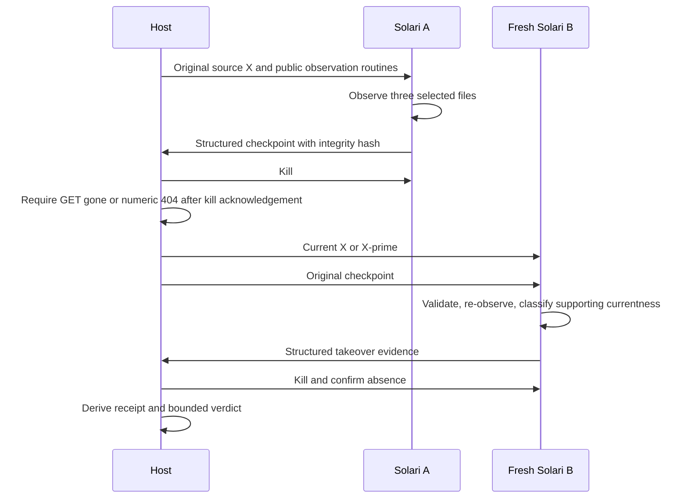

# Architecture

The host CLI coordinates a bounded demonstration. It does not infer semantic truth from formatted console output.

The HITO subset distinguishes documentary evidence, structural declarations and physically observed bytes. Its existing claim routine produces evidence/support identities. Its existing refresh routine assigns CURRENT, STALE or UNKNOWN based on observed supporting identities. The existing contradiction routine preserves an INDETERMINATE assessment when no supported contradiction is found; it does not claim absence of contradictions.

The public wrapper observes only `README.md`, `package.json` and `src/index.js`, with 64 KiB per file. Missing files remain unavailable; oversized or failed reads can remain indeterminate. Symlinks are excluded. It does not recursively discover a repository. A logical fixture subject identifies this demonstration; a general cross-project subject resolver is not supplied.

Checkpoint content is validated by reconstructing artifact and claim support, unknowns and authority fields. Its hash detects corruption; it is not a signature, external authenticity proof, or license to trust an arbitrary sender. This controller captures and restores its own checkpoint. It does not accept arbitrary local checkpoints or private project roots as input.

Current source is provisioned separately from the checkpoint. B reads it independently, once per selected file, before classifying the old support. Old claims are retained as historical evidence rather than overwritten to look current. The controller compares observed current hashes to the exact selected fixture. The receipt only projects this structured evidence.

The application stores its public checkpoint under `.maat/solari-public-checkpoint.json`. This is a separate, bounded public format; it is not a replacement schema or importer for the private full-runtime capsule. No private HITO state or dependency is required.

The key stays on the host in the SDK configuration. It is not injected into the guest, source fixture, checkpoint, or receipt. Remote error text is not retained; failure paths emit fixed messages. Persisted application text is also filtered for the exact supplied key. The user should inspect any live `runs/` directory before publishing it; historical summaries in this contribution are separately sanitized.

The SDK comes from npm. No SDK, Node binary, dependency tree or generated build output is vendored. TypeScript runs through Node's native type stripping; `typecheck` separately verifies it. See [Node TypeScript documentation](https://nodejs.org/api/typescript.html).
