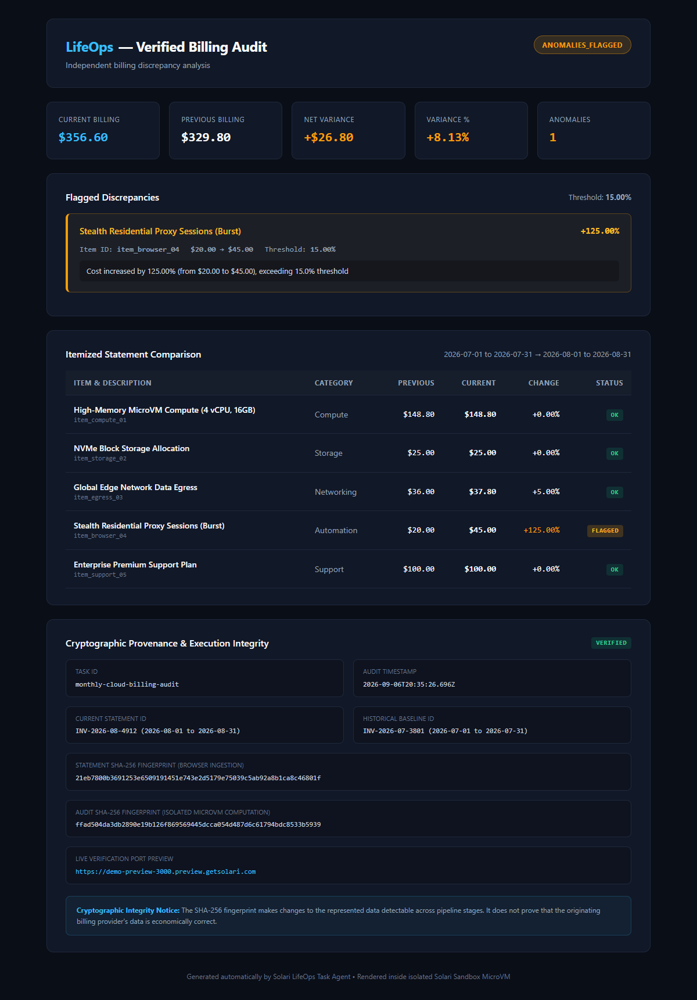

# LifeOps — Verified Billing Audit

An automated billing discrepancy auditor built on Solari. An agent takes billing statements, runs an isolated audit script inside an ephemeral Solari Sandbox microVM, flags line-item anomalies against historical baselines, and serves a live verification dashboard directly from the microVM via Solari Port Preview.



## Architecture

```text
Statement Input (Current + Historical Baseline)
         │
         ▼
Solari Sandbox MicroVM (template: "base")
         │  • Transfer current & baseline statements to /workspace
         │  • Execute isolated in-guest Python audit script
         ▼
Discrepancy Audit Result & SHA-256 Provenance Manifest
         │
         ▼
In-Guest Dashboard Server (Port 3000)
         │  • Ingest standalone HTML dashboard to /workspace/index.html
         │  • nohup python3 -m http.server 3000
         ▼
Solari Port Preview (`sandbox.previewUrl(3000)`)
         │  • Probe edge tunnel reachability
         │  • Display live URL for human review
         ▼
Guaranteed Teardown (`sandbox.kill()` in `finally`)
```

## Why run the audit inside a Sandbox?

Calculating billing discrepancies and evaluating business rules outside an isolated environment introduces configuration drift and security risks when handling external data. Running the audit inside a clean Linux microVM gives:

1. **Deterministic Isolation**: Calculations run against clean Python standard library in an ephemeral VM.
2. **In-Guest Artifact Hosting**: The verification dashboard HTML lives directly inside the execution environment that computed it.
3. **Zero-Framework Frontend**: No React, Next.js, Vite, or Tailwind. Pure vanilla HTML/CSS served directly by Python's built-in HTTP server.
4. **Guaranteed Teardown**: The microVM is killed on completion or interruption, leaving zero orphaned cloud infrastructure.

## Deterministic Demo Scenario

The bundled demo evaluates an August 2026 invoice against a July 2026 baseline:

- **Baseline Total (July 2026):** `$329.80`
- **Current Total (August 2026):** `$356.60`
- **Overall Variance:** `+$26.80 (+8.13%)`
- **Configured Threshold:** `15.00%`
- **Flagged Anomaly:** `item_browser_04` (*Stealth Residential Proxy Sessions*) jumped from `$20.00` to `$45.00` (**+125.00%**).

A top-level total alert (e.g. alert on >10% bill increase) would miss this. By auditing at the line-item level inside the microVM, LifeOps catches the critical localized spike.

## Run Offline Unit Tests

```bash
cd applications/lifeops
npm install
npm test
npm run typecheck
```

Runs 22 deterministic assertions (threshold boundaries `14.99%`, `15.00%`, `15.01%`, `-14.99%`, `-15.00%`, `-15.01%`, zero-baseline safety, XSS escaping, and manifest hashing) without consuming API credits.

## Run Live against Solari

Copy `.env.example` to `.env` and add your Solari API key:

```bash
cp .env.example .env
# Edit .env: SOLARI_API_KEY=slr_live_...
```

Then run:

```bash
npm start
```

For non-interactive or CI execution (waits 5s for preview warm-up, then exits cleanly):

```bash
LIFEOPS_NON_INTERACTIVE=true LIFEOPS_PREVIEW_TIMEOUT_SEC=5 npm start
```

### Expected Output

```text
=========================================================
LIFEOPS — VERIFIED BILLING AUDIT
================================

Variance Threshold: 15%

--- Stage 1: Statement Ingestion ---
✓ Current statement loaded: INV-2026-08-4912 (August 2026) - Total: $356.60
✓ Baseline statement loaded: INV-2026-07-3801 (July 2026) - Total: $329.80
✓ Statement SHA-256 fingerprint: 21eb7800b3691253e6509191451e743e2d5179e75039c5ab92a8b1ca8c46801f

--- Stage 2: Isolated Sandbox Audit ---
[Sandbox Engine] Provisioning isolated Solari Sandbox microVM (template: "base")...
[Sandbox Engine] MicroVM booted successfully (id: vm_002020...)
[Sandbox Engine] Connecting secure control channel...
[Sandbox Engine] Initializing guest workspace directory...
[Sandbox Engine] Transferring current statement and baseline...
[Sandbox Engine] Executing isolated discrepancy audit (threshold: 15%)...
[Sandbox Engine] In-guest output: [Guest Audit] Completed. Status: ANOMALIES_FLAGGED, Anomalies: 1, Net Variance: $+26.80 (+8.13%)
[Sandbox Engine] Reading verified audit artifacts from guest filesystem...
[Sandbox Engine] Audit result verified on host. Status: ANOMALIES_FLAGGED
✓ Sandbox microVM provisioned
✓ Current + baseline statements transferred to guest
✓ Discrepancy audit executed inside isolated microVM
✓ 1 anomaly detected
✓ Audit SHA-256 fingerprint: ffad504da3db2890e19b126f869569445dcca054d487d6c61794bdc8533b5939

--- Stage 3: Verification Dashboard & Port Preview ---
✓ Dashboard HTML generated
[Sandbox Dashboard] Ingesting verification dashboard into guest filesystem (/workspace/index.html)...
[Sandbox Dashboard] Launching in-guest HTTP server on port 3000...
[Sandbox Dashboard] Verifying preview tunnel reachability...
[Sandbox Dashboard] Preview tunnel verified active and reachable.
✓ In-guest HTTP server started on port 3000
✓ Solari port preview active

Verification Dashboard: https://<sandbox-id>-3000.preview.getsolari.com?token=...

Status: ANOMALIES_FLAGGED
Net variance: +$26.80 (+8.13%)
Anomalies: 1

  ⚠ [item_browser_04] Stealth Residential Proxy Sessions (Burst)
    $20.00 → $45.00 (+125.00%) [Threshold: 15%]
    Reason: Cost increased by 125.00% (from $20.00 to $45.00), exceeding 15.0% threshold

✓ Sandbox destroyed
✓ Verification session complete.
```

## Solari Gotchas Encoded

- **`commands.run` is not shell-interpreted:** Passing `"python3 -m http.server 3000 &"` directly looks for a binary with that entire name. Backgrounding in-guest requires explicit shell invocation:
  ```ts
  await sandbox.commands.run("sh", {
    args: ["-c", `cd /workspace && nohup python3 -m http.server ${port} >/dev/null 2>&1 &`],
  });
  ```
- **`kill()`, not `close()`, ends a VM:** `sandbox.close()` drops your local connection channel; the VM keeps running and billing until its idle timeout. `activeSandbox.kill()` is called unconditionally in `finally` and `SIGINT`/`SIGTERM` handlers.
- **`timeoutMs` is a rolling idle window:** It resets on every SDK action.
- **Port Preview tunnel warm-up:** Public DNS and edge routing may take 1-3 seconds to propagate after `sandbox.previewUrl()` returns. The client probes with exponential backoff before presenting the URL.

## Integrity Notice

> **Cryptographic Integrity Notice:** The SHA-256 fingerprint makes changes to the represented data detectable across pipeline stages. It does not prove that the originating billing provider's data is economically correct.
