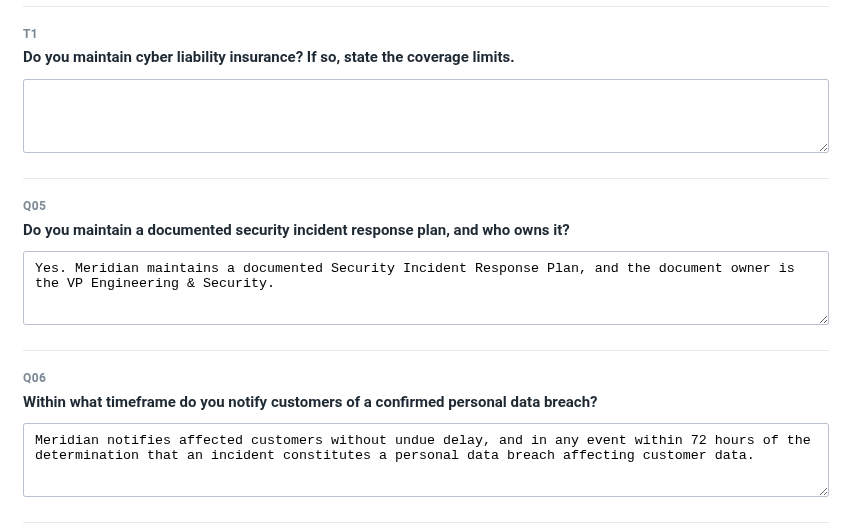

# TrustFill

**Answers a customer's security questionnaire from your own security documents — and leaves blank the questions your evidence doesn't support.**



That gap is the product. Nothing in the evidence mentions cyber liability insurance, so TrustFill didn't answer it — and it didn't answer it *in the middle of the form*, not by running out of steam at the end.

```bash
npm install
cp .env.example .env          # add SOLARI_API_KEY
npm run demo
```

```
  TrustFill · replaying captured fixtures
  26 answered · 4 left blank

  portal  https://…preview.getsolari.com
  pass 1  logged in with credentials
  pass 1  profile saved (cookies + localStorage)
  pass 2  restored from profile — no login form touched

  filled 26 · blank 4
  portal says: Draft saved · 26 of 30 answered

  ── needs a human ─────────────────────────────────────────
  T1   Do you maintain cyber liability insurance? If so, state the coverage limits.
       INSUFFICIENT — the evidence does not answer this question

  T2   How frequently do you commission third-party penetration testing?
       INSUFFICIENT — the evidence does not answer this question

  T3   What is your recovery time objective (RTO) for the loss of an entire serving region?
       CONFLICTING — sources disagree; a human must resolve which is current

  T4   Do you agree to notify affected customers of a confirmed breach within 24 hours?
       OUT_OF_SCOPE — asks for a commitment, not a fact; needs someone with authority

  3 answer(s) had unsupported detail removed: Q05, Q11, Q23
```

**Four blanks, four different reasons.** That's the difference between a system that gave up and one that made four distinct judgements.

---

## The problem

An enterprise customer sends a security questionnaire. The answers all exist — in your SOC 2 report, your incident response plan, your architecture docs — and somebody spends a day moving them into a web form.

The hard part isn't typing. It's knowing which questions your evidence *doesn't* answer. A confident wrong answer in a security questionnaire is a contractual problem, and the questions most likely to get one are the ones where the evidence is nearly-but-not-quite there.

## The four questions it refuses

The demo corpus is built so that each refusal fails differently:

| | Question | Why it's refused |
|---|---|---|
| **T1** | Cyber liability insurance? | Never mentioned. 25,000 characters, zero hits. |
| **T2** | How often do you pen test? | Two documents discuss penetration testing at length — scope, methodology, remediation timelines. Neither states a cadence. A system that pattern-matches the surrounding detail answers "annually" from training priors. |
| **T3** | RTO for regional loss? | The incident response plan says 4 hours. The architecture overview says 12. Same scenario, documents eleven months apart. |
| **T4** | Agree to a 24-hour breach SLA? | Asks the vendor to *accept an obligation*, not state a fact. The corpus supports a related fact (72 hours) — answering with it would silently decline the actual question. |

**T2 and T3 are the interesting ones.** Absence is easy to detect. Evidence that is *about* the right topic but doesn't contain the fact, and evidence that contradicts itself, are where a naive system answers confidently.

## How it works

```
evidence corpus ──► draft ──► verify ──► score ──► trim ──► fill
                     │          │          │        │        │
              sufficiency   atomic    supported/  drop     Solari
              + citations   claims     total    unsupported browser
                                                incidentals
```

**Draft.** Classify the question as `SUFFICIENT`, `INSUFFICIENT`, `CONFLICTING` or `OUT_OF_SCOPE`, and where sufficient, answer it with verbatim quotes.

**Verify.** Decompose that answer into atomic claims. Mark each one *essential* (the fact the question asked for) or *incidental* (context the answer volunteered), and check each against the cited quotes.

**Abstain** when an essential claim is unsupported. Unsupported *incidental* claims don't sink the answer — they get removed from it, and the reviewer is told what was removed.

**The trust score is `supportedClaims / totalClaims`**, measured from what the citations establish. It is deliberately *not* the model's self-reported confidence, which measures ~0.95 even while abstaining and is not calibrated enough to gate on.

**It never submits.** There is no code path that clicks submit. The agent prepares a draft; a human approves it.

## What Solari buys here — and what it doesn't

Every submission claims its project is impossible without the platform. Here's the accurate line.

**What it buys:**

- **The corpus is processed in a VM that dies with the run.** For a tool that automates *security* questionnaires, having a defensible answer for where your SOC 2 report gets processed is a product requirement, not a convenience.
- **The portal is reproducible.** You get a working customer portal on a public URL in about six seconds, with no credentials of your own.
- **Profiles skip re-authentication**, including the MFA that real procurement portals enforce.

**What it doesn't:**

- **The corpus still reaches the model provider.** The sandbox keeps it off local disk and destroys it with the run. It does not keep it inside the VM.
- **Session replay is unverified here.** Sessions are created with `recording: true` and the code degrades gracefully, but `getReplayUrl` returned 404 on every attempt on this account — likely plan-gated. No replay artifact is claimed.
- **Profile reuse is shown within one portal lifetime, not across runs.** Each run gets a fresh sandbox on a fresh hostname, and cookies are domain-scoped. That's a property of an ephemeral demo portal; a real customer's portal has a stable domain.
- **Driving a browser and persisting `storageState` are replicable in local Playwright.**

## Engineering decisions

**Deterministic browser, AI for documents.** Navigation uses stable `data-testid` selectors. No model decides where to click. Ambiguity lives in the evidence, not in the DOM — that's where the model is pointed.

**Abstention is a designed output, not an error path.** It has its own schema value, its own reasons, and its own tests.

**A draft that abstains cannot carry an answer.** A model that classifies `INSUFFICIENT` and then answers anyway has contradicted itself; that's a schema violation, caught at the edge rather than reconciled later.

**No vector database.** The corpus is ~6,000 tokens. It goes in the context window. A retrieval stack here would be architecture for its own sake.

**Model responses are recorded and replayed.** A live pass takes over two hours against this provider, so the test suite would never be run. `npm test` touches no network; `--live` re-runs against the model for anyone who wants to watch it think.

**A missing form field is an error, not a smaller number.** If the portal isn't shaped the way the adapter expects, the run raises `PortalChangedError` rather than reporting "26 of 30" against a portal it doesn't recognise.

**A crashed question is not an abstention.** It's left blank and reported as a failure. Treating a crash as "no evidence" would be a different lie from the one this exists to prevent.

## Running it

```bash
npm install
cp .env.example .env
```

`SOLARI_API_KEY` is required — it boots the portal and drives the browser. Answers replay from committed fixtures, so no model key is needed.

```bash
npm run demo        # fill the questionnaire, then tear everything down
npm run demo:keep   # fill it and leave the portal up so you can look at it
npm run demo:live   # re-run the model instead of replaying (slow)
npm run portal      # boot the portal alone, no filling
npm run cleanup     # kill leftover sandboxes
npm run check       # typecheck + 62 tests, no network
npm run capture     # regenerate fixtures after changing a prompt or model
```

`.env` is read automatically; nothing needs sourcing first.

### Looking at the filled portal

`npm run demo` destroys the sandbox as soon as it finishes, so there is nothing
left to open. Use `demo:keep`, which prints a URL and holds the sandbox until you
press Ctrl-C:

```
https://<id>-3000.preview.getsolari.com?pt_token=<token>

sign in as   vendor@meridian.example
password     trustfill-demo
```

**Open the whole URL including `?pt_token=`.** The preview gateway authenticates
with that token and returns 401 without it. The path goes *before* the query
(`https://host/questionnaire?pt_token=…`), and the token expires about an hour
after it is minted — re-run `demo:keep` for a fresh one.

The blanks are questions 5, 12, 20 and 27.

### One concurrent session

The plan used here allows a single live session, so a leftover sandbox blocks the
next run with `ConcurrencyLimitExceeded`. That happens whenever a run is
interrupted hard enough to skip its cleanup — a killed terminal, or Ctrl-C that
does not reach the handler.

```bash
npm run cleanup -- --dry   # list what is live
npm run cleanup            # kill it
```

## Everything here is synthetic

Meridian Systems and Northwind Corp do not exist. The evidence corpus, the questionnaire, and the credentials in `simulator/portal.py` are all fabricated for this demo and safe to commit. No real company's security documents are used, and no real procurement portal is contacted.

## Where this goes

The engine is form-agnostic — a security questionnaire is one adapter. Vendor onboarding, RFP responses and insurance submissions are the same shape: repeated questions answered from stable internal facts.

The durable asset isn't the filler, which is commoditising fast. It's the governed corpus underneath: what your company can truthfully claim about itself, with provenance, staleness and contradiction detection. Form-filling is one way to distribute that.
