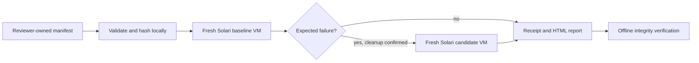

# Architecture

## Boundaries

- `src/domain.ts`: strict manifest parsing, result parsing, verdict rules, input hashing. This is the primary pure test seam.
- `src/runner.ts`: sequential execution, deadline/cancellation, session journal and final receipt. An injected provider is the external boundary used by offline tests.
- `src/solari.ts`: official `@solarisdk/sandbox` 0.1.3 adapter. It creates headless base sandboxes and sends a fixed Python runner plus a base64 JSON payload through `commands.run`. No persistent WebSocket is needed on the supported one-shot route.
- `guest/runner.py`: bounded subprocess execution, public pinned Git checkout or fixture files, identical probe materialization, runtime capture, structured result. It runs only inside the sandbox during normal use.
- `src/cli.ts` and `src/report.ts`: command-line UX, exclusive output directory, incremental JSON journal, final receipt and escaped static HTML. No server or database.

## State and evidence

`planned -> creating -> running -> cleaning -> released` for each lane. Any operation failure enters cleaning if a session exists. Release failure blocks another lane and makes the entire experiment inconclusive. Creation with an uncertain response is explicitly recorded; never blindly retry it with a new identity. SDK create retries preserve its generated idempotency key.

The verdict is independent of transport success: both lane outputs must parse, match the requested revision for Git sources, have successful setup, and satisfy the reviewer-defined exact exit/witness contract. Wrong, absent, truncated, or timed-out output cannot verify a patch. Candidate execution is skipped unless baseline failure is positively identified. Persist a journal event immediately after creation so interrupted runs retain an ID for recovery.

Store the parsed manifest, SHA-256 digest, timestamps, lane results, session IDs, states, durations, estimated requested-compute cost, and provider identity. Receipt verification checks integrity and recomputes the verdict. Hashes detect accidental edits; they do not authenticate the author or make guest claims trustworthy. No screenshot is needed for a terminal experiment: stdout, stderr, runtime identity, commit hashes, and visible verdict are the relevant evidence.

## Deadlines, retries, and recovery

Solari's `timeoutMs` is rolling idle. Set a short idle timeout with `lifecycle.onTimeout=kill`, plus a client wall deadline. The SDK HTTP transport has its own bounded retry count; bound every fetch and prevent new execution after a lane deadline. Cleanup uses a separate deadline so an expired run can still DELETE its VM. Record errors without losing the primary failure. Never retry guest commands automatically.

A killed client or network partition can leave a VM running. Idle kill is a fallback, not a guaranteed invoice cap. Journal IDs support explicit `cleanup <sessionId>`; use the console for ambiguous creation or a machine crash. Successful DELETE is provider acknowledgment, not independently measured hypervisor teardown.

## Security and reproducibility limits

No arbitrary host execution. JSON and argv separate data from commands. Only public `https://github.com/owner/repo` source URLs and full 40-hex revisions are allowed. Guest commands remain intentionally capable of running code; URL validation is not an egress firewall. No host environment, tokens, persisted profiles, mounts, or volumes are copied. Restrict file paths and payload size; cap output and process time. Escape HTML and terminal controls; never render guest HTML or execute downloaded content locally.

Python subprocess limits protect normal faulty workloads, not malicious root code in a VM. The provider owns machine isolation. The mutable `base` template and optional unpinned setup downloads mean experiments are observed reproduction, not hermetic builds. Record runtime versions and recommend pinned dependencies. Keep fixtures dependency-free.

## Why this shape

One process and local receipts are enough for one maintainer running two sequential jobs. A queue, accounts, database, browser, and LLM add no value to the experiment. Fresh environments are worth the second creation because shared environments can hide the bug through caches or setup contamination. An explicit provider seam earns its existence by making lifecycle failures testable without spending credits.
