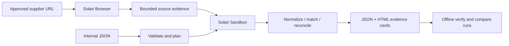

# ProcureLens architecture

Code lives in `examples/procurelens`. TypeScript owns input/provenance validation, acquisition, orchestration and reporting. A fixed Python standard-library module owns deterministic processing and is used identically by the Solari sandbox and local simulation/replay. Data crosses the boundary as JSON, never shell interpolation or executable supplier content.

## Interfaces

`src/model.ts`: Row, Acquisition, ProcessorInput, Reconciliation and Run types; strict input validation, hashes, supported source URL policy. `src/acquisition.ts`: parse bounded schema.org Product/Offer fragments, require visible corroboration, preserve record locators. `processor.py`: validate/normalize/match/reconcile and compare snapshots using Decimal. `src/solari.ts`: official browser and sandbox clients. `src/workflow.ts`: resource lifecycle, safe failure categories and run integrity. `src/cli.ts` and `src/report.ts`: plan/run/simulate/verify/report/compare and static HTML.

The external seam is a provider with browser acquire/close and sandbox process/kill. Tests inject failures there; they never allocate paid resources. The local processing seam executes only the repository's fixed processor with bounded JSON input, not manifests containing commands or supplier code.

## Evidence

Acquisition stores canonical source URL, timestamp, adapter version, requested page scope, completeness, relevant raw Product/Offer fragments and visible corroboration. Extracted rows reference fragment indexes. The report binds the acquisition, internal records and deterministic output with SHA-256. Verification reconstructs source rows from stored raw fragments, rechecks corroboration and recomputes results from the stored inputs. Missing/changed provenance is rejected, even when an outer hash is recomputed.

No full HTML, screenshots, cookies, browser storage, internal hostnames, signed IDs, control endpoints or infrastructure metadata enter shareable evidence. Relevant supplier product fields alone are retained. All real reports stay in ignored `runs/`. Public committed examples are synthetic and visibly labeled.

## Lifecycle and failure

Browser: not_started -> active -> released/uncertain. Sandbox begins only after complete acquisition and browser release. Sandbox: not_started -> active -> released/uncertain. The adapter explicitly calls `sessions.releaseAndWait()` independently of the Playwright disconnect, then closes the Solari client. Sandbox `kill()` destroys compute; `close()` alone is insufficient. Treat handles as opaque, not a guessed identifier grammar.

Run state is FAILED_ACQUISITION, FAILED_PROCESSING, CLEANUP_UNCERTAIN, REVIEW_REQUIRED or COMPLETE. Cancellation/deadline aborts work but cleanup has an independent budget. A late allocation must be released when its response arrives; ambiguous allocation is reported as uncertain. No retry that silently allocates another workflow. Private recovery handles may be retained only under ignored output paths, never public output or logs.

## Security and limits

Live navigation is limited to an exact Adafruit product URL. Block off-origin navigation and third-party requests where compatible with the page; service workers are disabled. Reject unsafe redirects, private/credential-bearing URLs, oversized data, missing selectors, multiple offers, duplicate extracted IDs and schema drift. No writes to supplier sites. Solari handles browser page scripts remotely. Sandbox receives only bounded records and the fixed processor, no host environment/secrets/mounts. Any unknown supplier field stays unknown.

A public page is not a quote or stock reservation. Locale, pack size, currency, VAT, contract pricing and quantity breaks can change meaning; V1 only compares the explicit listed-item basis. Results require human review. Hardware isolation is supplied by Solari, not independently proven here. Mutable service templates and supplier pages limit reproducibility; stored acquisition replay is deterministic, acquisition itself is observational.

## Simplicity decisions

One page adapter, JSON input, one fixed processor, local files, one HTML report. No fuzzy matching, CSV library, browser agent, LLM, DB, queue, auth service or microservices. Sandbox is the processing boundary for supplier/ERP records and can scale independently later; local replay remains necessary for verification, so Solari is a practical managed execution advantage rather than an irreplaceable algorithm.
