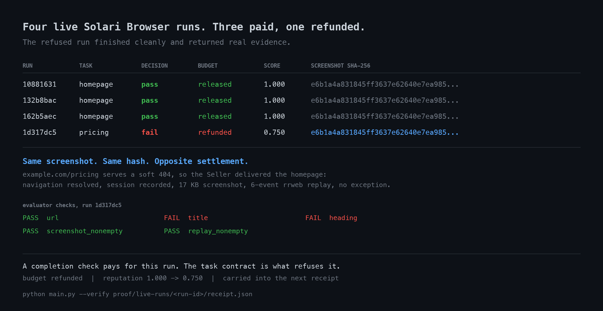

# Off-chain reputation clearing (Python)

Turn a real Solari Browser run into a portable receipt, settle its budget in
SQLite, and build reputation without a token or chain.

Payment rails prove that money moved. They do not prove that the work deserved
payment. Neither does completion: an agent can finish cleanly, return a real
screenshot and a real replay, and still have done the wrong thing.

The four roles are deliberately small:

- **Seller** opens the task URL in a recorded Solari Browser session and saves
  a screenshot plus rrweb replay.
- **Evaluator** checks the delivered page against the task contract, and the
  evidence against a minimum bar.
- **Verifier** hashes the evidence and receipt so a later reader detects a
  swapped file.
- **Buyer** holds 100 cents in SQLite, releases it only on pass, and refunds it
  on failure.

Each receipt includes the Seller's updated score and the previous receipt hash,
forming a portable history. This detects evidence replacement after settlement;
it is not a signature or proof against an operator rewriting the whole history.

## Run

```bash
cd examples/offchain-reputation-clearing-py
python -m venv .venv
source .venv/bin/activate
pip install -r requirements.txt
export SOLARI_API_KEY=slr_live_...   # https://console.getsolari.com

python main.py                       # the page exists: pass, budget released
python main.py                       # again: a second linked receipt
python main.py --task pricing        # the page does not exist: fail, refunded
python main.py --verify runs/<run-id>/receipt.json
```

`--task pricing` is the interesting one. `example.com/pricing` serves a soft
404: the navigation resolves, the session records, the Seller returns a real
screenshot and a real replay, and nothing raises. A completion check pays for
that run. The Evaluator reads the page instead — `Example Domain` where the
task asked for `Pricing` — and refuses, so the budget is refunded and the
score drops.

Generated evidence and the SQLite ledger stay under `runs/`, which is ignored
by Git. Copy a run directory with its `receipt.json`, `screenshot.png`, and
`replay.ndjson` to let another agent verify the receipt.

Four live Solari Browser runs are checked in under
[`proof/live-runs`](proof/live-runs) — three paid, one refunded, all linked in
one hash chain. They contain no API key or authentication material.



The refused run's screenshot is byte-identical to the three that were paid: the
soft 404 rendered the same page, so all four receipts carry the same evidence
digest. See [`proof/README.md`](proof/README.md) for the full reading.

Source: [`main.py`](main.py)
