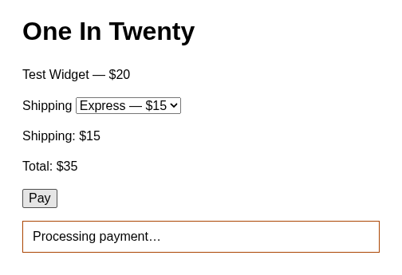
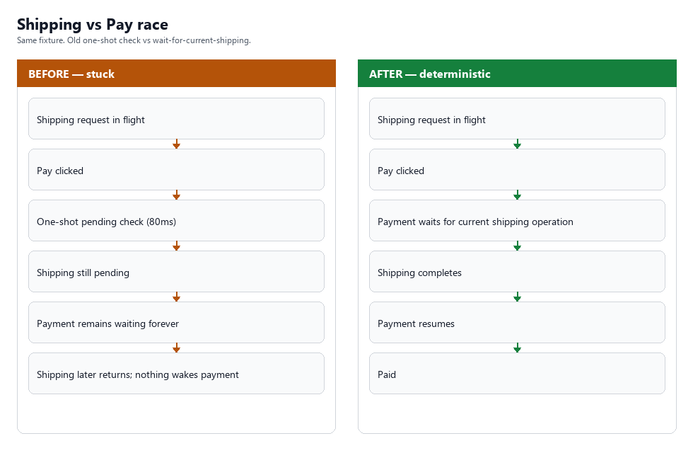
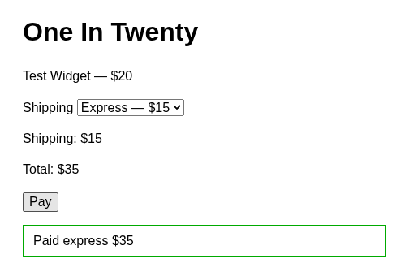

# One in Twenty

**One-in-Twenty is a Solari-powered harness for reproducing, diagnosing, and verifying intermittent browser race conditions using real sandboxes, port previews, and recorded browser sessions.**

The checkout page is the test fixture, not the product. A Solari Sandbox hosts it, a public preview URL (`*.preview.getsolari.com`) serves it, and recorded Solari Browser sessions drive it. The fixture plants a client/server shipping-vs-pay timing race, reproduces it across isolated sessions, and shows a deterministic state-driven fix.

This is a cookbook example, not production payment code.

## Visual walkthrough

### 1. The intermittent failure



The checkout could become permanently stuck at `Processing payment...` when shipping was still in flight during the old one-shot payment check.

### 2. The race



The shipping request could finish successfully after the payment check, but the successful response had no mechanism to resume payment.

### 3. The deterministic fix



Payment now waits for the current shipping operation and resumes when that operation completes. Stale shipping responses remain ignored.

### Validation

- 20/20 PASS at 820 ms
- 20/20 PASS at 860 ms
- 20/20 PASS with randomized 250–899 ms delay
- 60/60 total live runs PASS
- 6/6 regression tests PASS

## What it demonstrates

- A real Solari Sandbox serving a tiny checkout page
- Sandbox **port preview** (`*.preview.getsolari.com`)
- Recorded Solari Browser sessions (`recording: true`)
- A deliberately intermittent race between `/api/shipping` and Pay
- A bounded hunt: 20 fresh browsers against one sandbox
- Completing payment when the **current** shipping request finishes (not after one 80ms check)
- Sequence isolation so a stale shipping response cannot complete a newer checkout

## Why “One in Twenty”

Most single runs succeed. The race only shows up when shipping is still in flight at Pay’s old one-shot check. Repeating the same checkout in **fresh isolated browsers** makes that intermittent failure visible. The **fixed** code is not supposed to fail one in twenty.

## Setup

Node.js + npm. A Solari key from [console.getsolari.com](https://console.getsolari.com).

```bash
cd examples/one-in-twenty-ts
npm install
export SOLARI_API_KEY=slr_live_your_key_here
```

Do not commit a real key. `.env` is gitignored.

## Run the example

One recorded browser. It waits until shipping is ready, then Pay. Expect `checkout_state: paid`, then browser and sandbox cleanup.

```bash
npm start
```

## Hunt mode

Twenty **new** recorded browser sessions against the **same** sandbox preview. Each run changes shipping to Express, waits a think-time (default **720ms**), clicks Pay, and classifies `PASS` / `APP_FAIL` / `INFRA_FAIL`.

```bash
npm run hunt
npm run hunt -- --think-ms 820
```

Do not treat hunt as a load test. Twenty sessions is enough to see the runner. Runtime files go in `artifacts/` (gitignored).

## The bug

Changing shipping fires `GET /api/shipping` (server sleeps 250–899ms). Pay used to wait **80ms**, then if shipping was still pending it stayed in `paying` forever. The shipping 200 could arrive later and nothing completed payment.

## The fix

If Pay is waiting and shipping is still in flight, payment stays waiting. When the **current** shipping request finishes, it completes Pay. An older shipping response (stale sequence) does not apply over a newer request and cannot complete the wrong checkout. No extra sleeps or retry loops.

## Testing

```bash
npm test
```

The state machine has a focused regression (old one-shot check stays stuck; the fix completes after late shipping). The example was also run against real Solari sessions.

## Cleanup

Each browser session is closed. The sandbox is `kill()`ed. Call `solari.close()` so the TypeScript client does not hang.

## Scope

Focused race-condition example. It does not implement full production checkout error handling (for example a failed shipping HTTP response while Pay is waiting).
