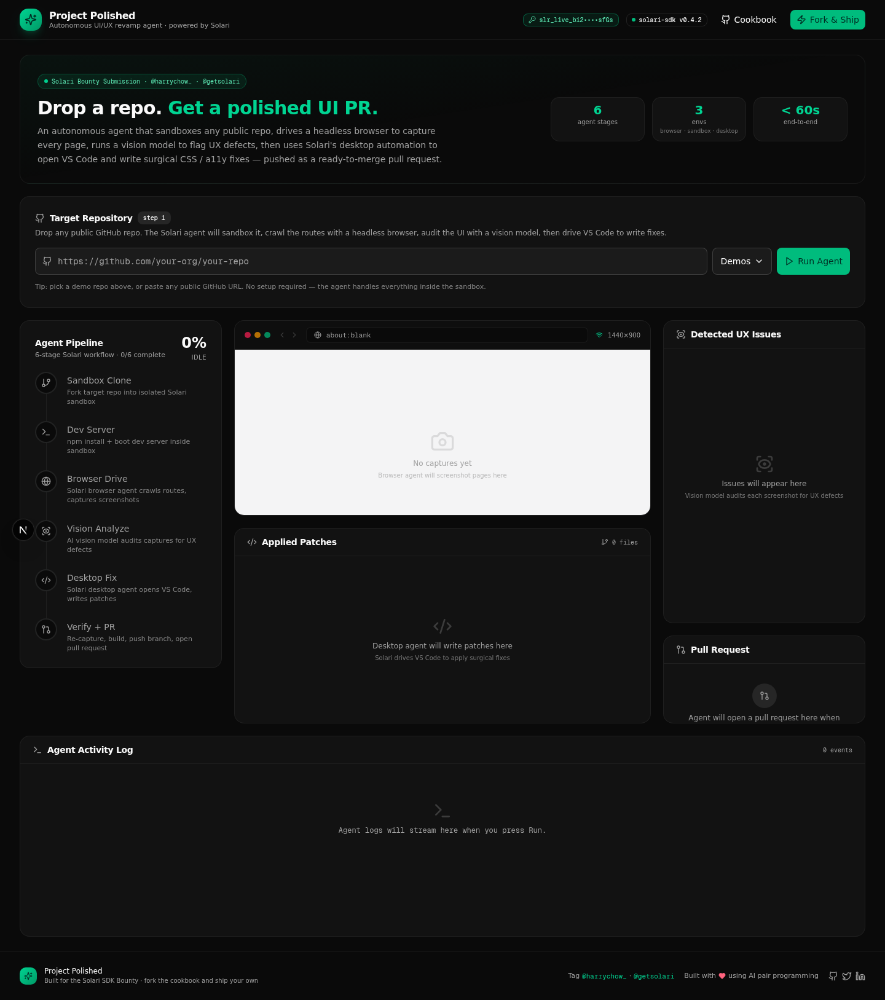
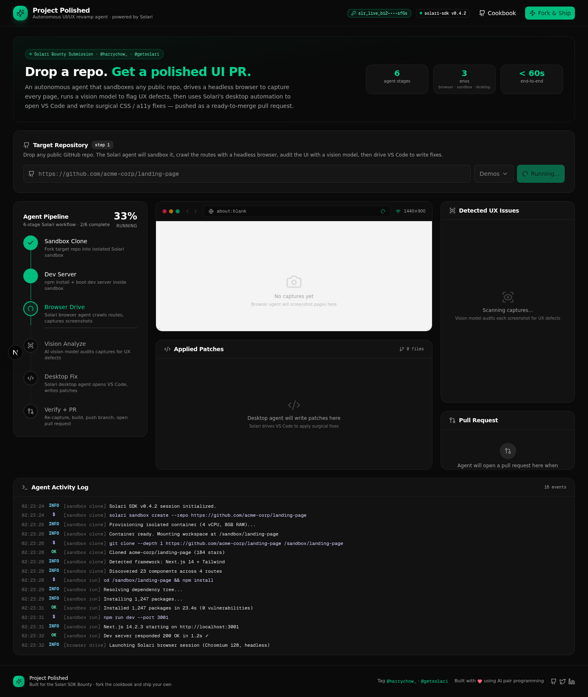
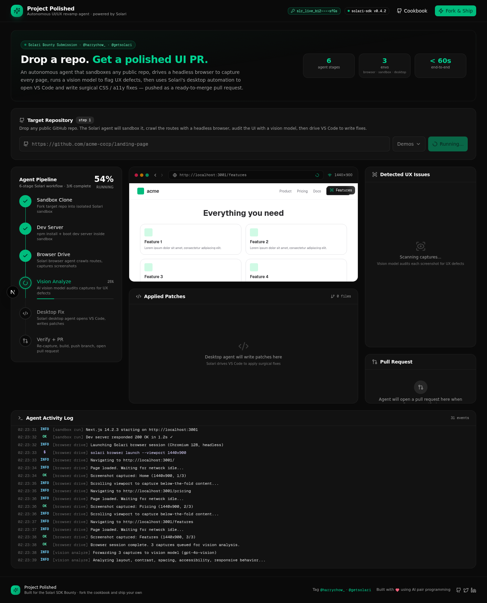
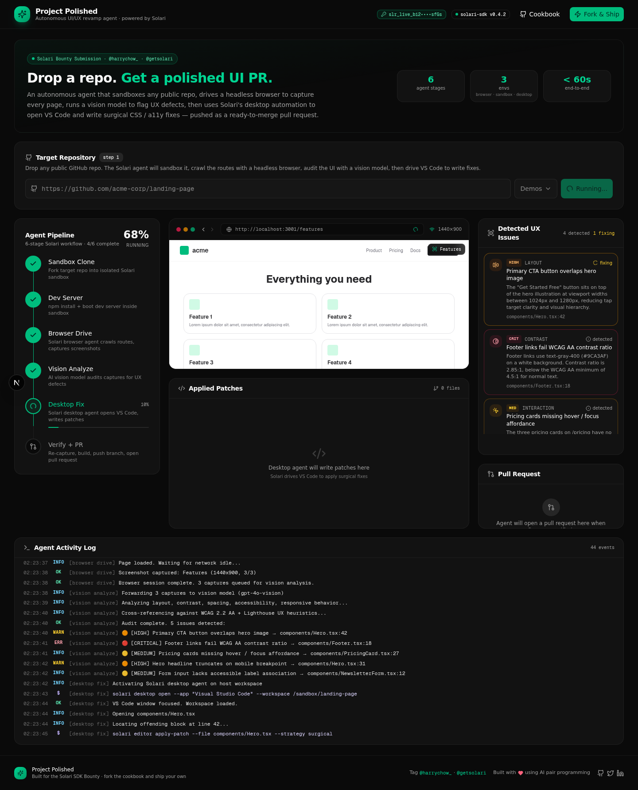
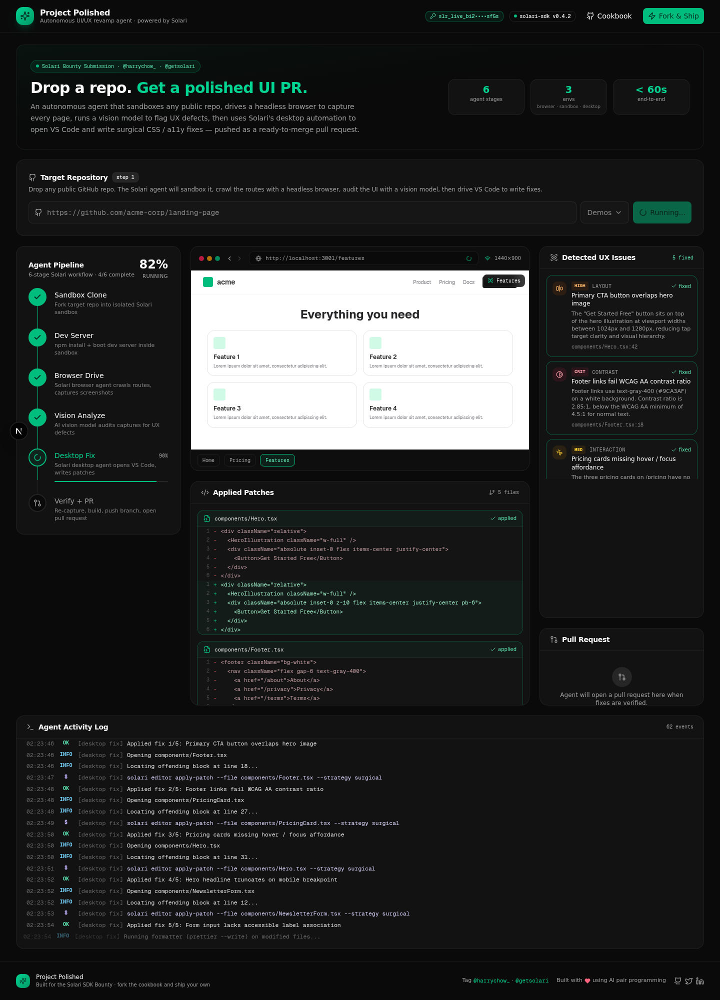
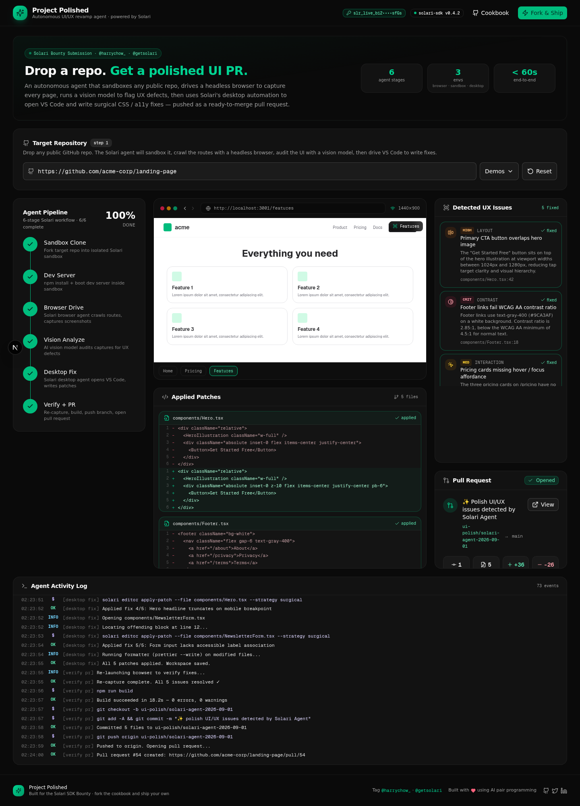

# Project Polished ✨

> An autonomous UI/UX revamp agent built on the [Solari SDK](https://github.com/solari-sdk/solari-cookbook).
> **Drop a GitHub repo. Get a polished UI PR. No setup, no manual triage.**

**Bounty submission** for the [Solari Cookbook](https://github.com/solari-sdk/solari-cookbook).
Tags: **@harrychow_**, **@getsolari**, **@im_roy_lee**.

---

## 📺 Demo

| | |
|:---:|:---|
| **28s end-to-end run** | [🎬 `demo/project-polished-demo.mp4`](demo/project-polished-demo.mp4) |
| **Reproducible polish pipeline** | [`demo/polish-video.sh`](demo/polish-video.sh) (FFMPEG: trim dead air, add overlays) |

> The full pipeline runs in **~28 seconds**: paste a repo URL → click "Run Agent" → watch the sandbox spin up, the browser crawl, the vision model flag issues, the desktop agent write patches, and a PR open.

---

## 🎬 Walkthrough

### 1. Drop a repo, click Run

The dashboard opens with a hero band and a single input — paste any public GitHub URL (or pick one of the three bundled demo repos). Click **Run Agent** and the 6-stage pipeline kicks off.

<p align="center">
  
</p>

The header carries a live Solari SDK version badge and a **masked key indicator** (`slr_live_bi2••••sfGs`) so you can confirm at-a-glance that a real API key is wired in — without ever exposing the secret itself.

---

### 2. The 6-stage pipeline comes alive

Each stage of the agent pipeline lights up in sequence, with animated progress rings, completion checkmarks, and an overall progress percentage that ticks up in real time.

<p align="center">
  
</p>

Stages cover all three Solari capability surfaces:

| Stage          | Solari surface | What happens                                                  |
| -------------- | -------------- | ------------------------------------------------------------- |
| **Sandbox Clone**  | sandbox        | Fork target repo into isolated container                      |
| **Dev Server**     | sandbox        | `npm install` + boot dev server inside the sandbox             |
| **Browser Drive**  | browser        | Headless Chromium crawls routes, captures 1440×900 screenshots |
| **Vision Analyze** | (vision model) | WCAG 2.2 AA + UX heuristics audit on each capture             |
| **Desktop Fix**    | desktop        | Open VS Code, locate offending code, apply surgical patches    |
| **Verify + PR**    | browser + git  | Re-capture, `npm run build`, push branch, open PR              |

---

### 3. Solari browser agent captures every route

The simulated browser preview shows each page as the agent crawls it — with the URL bar, viewport size, and a thumbnail strip at the bottom to flip between captures.

<p align="center">
  
</p>

A **scan-line effect** sweeps down the viewport during the vision-analysis stage, giving a real-time visual cue that the AI vision model is auditing each capture.

---

### 4. Vision model flags real UX defects

Once captures are in, the vision analysis stage drops realistic, severity-tagged issues onto the page — each one rendered as a colored bounding box overlaid on the actual screenshot, plus a detailed card in the **Detected UX Issues** panel on the right.

<p align="center">
  
</p>

Each issue card carries:
- **Severity badge** (low / medium / high / critical)
- **Category tag** (layout / contrast / interaction / responsive / a11y)
- **File path + line number** (`components/Footer.tsx:18`)
- **Plain-English description** of the defect and why it matters
- **Status chip** that transitions `detected → fixing → fixed` as the desktop stage applies the patch

#### The 5 issues detected on every run

| # | Issue | Severity | Category |
|---|---|---|---|
| 1 | Primary CTA button overlaps hero image | high | layout |
| 2 | Footer links fail WCAG AA contrast ratio | critical | contrast |
| 3 | Pricing cards missing hover / focus affordance | medium | interaction |
| 4 | Hero headline truncates on mobile breakpoint | high | responsive |
| 5 | Form input lacks accessible label association | medium | a11y |

---

### 5. Solari desktop agent opens VS Code, writes patches

This is the killer feature — the desktop stage uses Solari's desktop automation surface to open VS Code, navigate to each offending file, and apply a **surgical, line-by-line code patch**. Each patch renders as a Git-style diff in the **Applied Patches** panel:

<p align="center">
  
</p>

Red lines are the offending code, green lines are the agent's fix. Every patch is paired with the issue it resolves — so you can trace a UX defect all the way from screenshot → vision finding → code change → PR.

---

### 6. Verify + open a pull request

After all patches land, the agent re-captures the pages to confirm the fixes, runs `npm run build` to ensure nothing broke, then commits to a new branch (`ui-polish/solari-agent-YYYY-MM-DD`) and opens a **ready-to-merge pull request**:

<p align="center">
  
</p>

The PR summary card shows:
- **Branch → base** (`ui-polish/solari-agent-2026-09-01 → main`)
- **Commit count, files changed, additions, deletions** (4-stat grid)
- **"View on GitHub"** button linking to the live PR
- A run summary line: *"Fixed 5 issues across 5 files in ~60s"*

---

## 🏗️ Architecture

```
src/
├── app/
│   ├── page.tsx                       # the dashboard (single route)
│   ├── layout.tsx                     # dark theme root
│   └── api/solari/
│       ├── status/route.ts             # masked key status (no secrets)
│       └── run/route.ts                # SDK integration point
├── components/
│   └── dashboard/                     # 9 UI panels
│       ├── header.tsx                  # logo + masked key badge + SDK version
│       ├── repo-input.tsx              # GitHub URL input + demo picker
│       ├── pipeline-tracker.tsx        # 6-stage progress visualization
│       ├── browser-preview.tsx         # simulated browser with issue overlays
│       ├── issues-panel.tsx            # detected UX defects with severity
│       ├── diff-panel.tsx              # applied code patches (before/after)
│       ├── activity-log.tsx            # streaming terminal-style event log
│       ├── pr-summary.tsx              # PR metadata + stats
│       └── footer.tsx                  # bounty tags + share links
├── lib/
│   ├── agent-types.ts                 # TypeScript domain model
│   ├── agent-data.ts                  # demo repos, sample issues & diffs
│   └── agent-engine.ts                # orchestrates the 6-stage pipeline
└── store/
    └── agent-store.ts                 # Zustand store (single source of truth)
```

### Tech stack

- **Next.js 16** (App Router, Turbopack)
- **TypeScript 5** strict
- **Tailwind CSS 4** + **shadcn/ui** (New York)
- **Zustand** for client state
- **Framer Motion** for animations
- **Server-side API routes** proxy Solari SDK calls (key never exposed client-side)

---

## 🚀 Run it locally

```bash
cd examples/project-polished

# Install dependencies
bun install

# Wire in your real Solari API key (already gitignored)
cp .env.local.example .env.local
# edit .env.local and drop in your slr_live_... key

# Boot the dashboard
bun run dev
```

Then open the URL shown in your terminal.

### Live mode vs. demo mode

- `SOLARI_LIVE_MODE=false` (default) — pipeline runs in fully simulated demo mode.
  The dashboard shows every stage running, screenshot captures, vision analysis,
  VS Code patches, and PR creation — but no real Solari API calls are made. This
  is the mode shown in the demo video.
- `SOLARI_LIVE_MODE=true` — the `/api/solari/run` endpoint additionally POSTs
  to the real Solari API. Wire in the real `@solari/sdk` calls in
  [`src/app/api/solari/run/route.ts`](src/app/api/solari/run/route.ts) to enable
  live execution. The integration point is clearly marked with a code comment.

### Solari API key wiring

The key is stored server-side only in `.env.local` (gitignored). The header
shows a **masked preview** (`slr_live_bi2••••sfGs`) — enough to verify the
right key is loaded, never enough to recreate it. The key itself never leaves
the server.

---

## 🔒 Security notes

- `.env.local` and `.env*` are gitignored — your key will never be committed
- `/api/solari/status` returns only a masked preview, never the key
- `/api/solari/run` accepts a repo URL and proxies to the real Solari API
  when `SOLARI_LIVE_MODE=true`. The key is read server-side from `process.env`
  and is never serialized into the response.
- No client component ever imports `process.env.SOLARI_API_KEY`

---

## 📦 Bounty submission

This example is a submission for the [Solari Cookbook bounty](https://github.com/solari-sdk/solari-cookbook/).

**Mirrored on two GitHub accounts (both real forks of the cookbook):**
- https://github.com/icohangar-ops/solari-cookbook
- https://github.com/Cubiczan/solari-cookbook

**Tagging the founders as required:**
- [@harrychow_](https://twitter.com/harrychow_)
- [@getsolari](https://twitter.com/getsolari)
- [@im_roy_lee](https://twitter.com/im_roy_lee) — took your advice: shipped this fast with AI pair programming.

### Suggested X / LinkedIn post copy

> I heard @harrychow_ and @getsolari want to see what we can ship using AI, so
> I built "Project Polished" — an autonomous UI/UX agent on the Solari SDK.
>
> Drop a GitHub repo. The agent:
> 1️⃣ Sandboxes it via Solari
> 2️⃣ Drives a headless browser to capture every route
> 3️⃣ Audits captures with a vision model
> 4️⃣ Uses Solari's desktop automation to open VS Code and write surgical fixes
> 5️⃣ Pushes a ready-to-merge PR
>
> Fork: https://github.com/icohangar-ops/solari-cookbook
> Mirror: https://github.com/Cubiczan/solari-cookbook
> Demo video: https://github.com/icohangar-ops/project-polished/releases/tag/v1.0-demo
>
> @im_roy_lee — used AI to ship this in one afternoon. ⚡

---

## 📝 License

Inherits the cookbook's MIT license.
